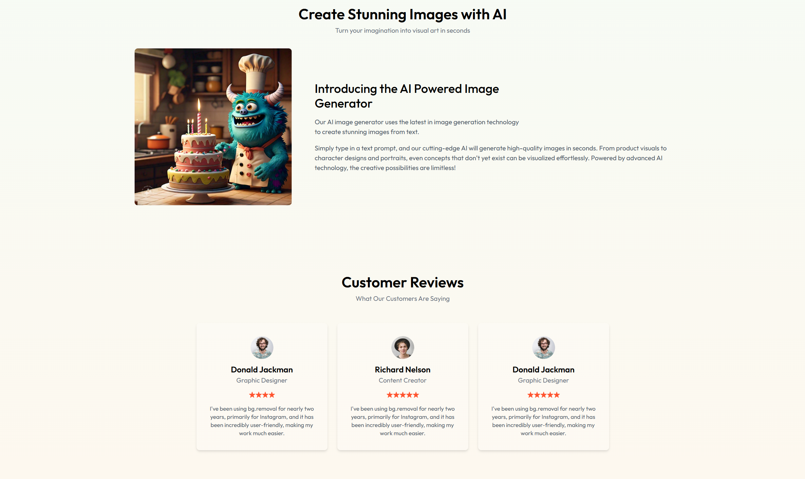

# Imagify AI Image Generator

A modern web application that leverages DALL-E's AI to transform text descriptions into stunning images. Built with React, Node.js, and MongoDB, featuring secure authentication and integrated payment processing.

## Screenshots

### Landing Page


Transform your text into stunning visuals with our AI-powered image generator.

### How It Works


Simple 3-step process to generate your images:

1. Describe Your Vision
2. Watch the Magic
3. Download & Share

### AI Image Generation


Our cutting-edge AI technology creates high-quality images from your text descriptions.

### Pricing Plans


Choose from our flexible pricing plans:

- Basic: $10/100 credits - Best for personal use
- Advanced: $50/500 credits - Best for business use
- Business: $250/5000 credits - Best for enterprise use

### Generated Image Example


Download or generate more images with a single click.

## Key Features

- AI-powered image generation using DALL-E
- User authentication and credit system
- Secure payment integration with Razorpay
- Responsive modern UI with Tailwind CSS
- Image download and sharing capabilities

## Setup

1. Clone repository

```bash
git clone <your-repo-url>
cd imagify-ai-gen-app
```

2. Install dependencies

```bash
npm install
```

3. Configure environment variables create 2 env files ( one for client and one for server)
   Create `.env` file in root:

```
MONGO_URI = your_mongo-uri
JWT_SECRET= your_random_jwt_secret
CLIPDROP_API_KEY = any_ai_or_clipdrop_api_key
RAZORPAY_KEY_ID= razorpay_id_for_payments
RAZORPAY_KEY_SECRET= razorpay_secret
CURRENCY = currenct_for_payments
VITE_BACKEND_URL= backend_url_localhost:3000
VITE_RAZORPAY_KEY_ID = same as your razorpay id for backend
```

4. Setup MongoDB

- Create account at [MongoDB Atlas](https://www.mongodb.com/atlas/database)
- Create new cluster
- Get connection string and add to `.env`

5. Run development server for client and server by running terminals

```bash
npm run dev
npm run server
```

Open [http://localhost:5173](http://localhost:5173)

```bash
localhost:3000 for server api
```

## Features

- AI image generation
- Image transformations
- User authentication
- Image sharing

## Deployment

1. Push to GitHub

```bash
git init
git add .
git commit -m "Initial commit"
git branch -M main
git remote add origin <your-github-repo-url>
git push -u origin main
```

2. Deploy on Vercel

- Connect your GitHub repository to [Vercel](https://vercel.com)
- Add environment variables in Vercel project settings
- Deploy!
